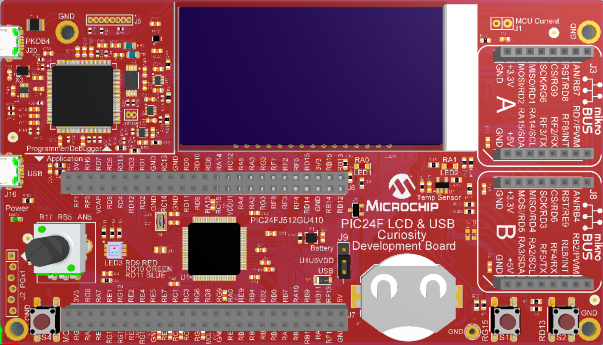

 

# PIC24F LCD USB Curiosity Development Board Out-of-the-Box Demo

## Summary

This is the demo software which runs on PIC24F LCD USB Curiosity Development Board (DM240018). The PIC24F LCD USB Curiosity Development Board is a cost-effective, fully integrated development platform targeted at first-time users, Makers, and those seeking a feature-rich rapid prototyping board. Refer to https://www.microchip.com/pic24flcdusbcuriosity for additional details about the board.

## Related Documentation

- PIC24F GU/GL Low Power MCUs (https://www.microchip.com/PIC24F-GU-GL)
- PIC24FJ512GU410 microcontroller (https://www.microchip.com/PIC24FJ512GU410)

## Hardware Used 

- PIC24F LCD USB Curiosity Development Board (https://www.microchip.com/pic24flcdusbcuriosity) 

## Software Used 

- MPLAB® X IDE v5.40 or newer (https://www.microchip.com/mplabx)
- MPLAB® XC16 v1.50 or newer (https://www.microchip.com/xc)
- MPLAB® Code Configurator(MCC) v4.0.1 (https://www.microchip.com/mcc)

## Operation

This example has two main modes of operation 
1. USB powered mode
2. Battery powered mode.

## USB Powered Mode

In USB powered mode, there are several different display modes.  Pressing the S2 button will switch between each of the display modes.

The first display mode just toggles between the text "PIC24" and "LCD".  This toggling is done automatically by the LCD module using the alternate display mode of the module.  The core sets up the LCD module with the "PIC24" text in the main display memory and the "LCD" text in the alternate display memory and the LCD automatically toggles between the two texts.

The second display the 12-bit value of the potentiometer.

The third display is the build time of the project.  Note that this is the build time of the build_time.c file.  If you don't clean/build the project then the time will not update from the last time that particular file was built.

The forth display is the current temperature.  This is measured from the TC77 on the board.  The temperature toggles between Celsius and Fahrenheit using the LCD alternate display mode.  The values are set just once for both and the LCD automatically toggles between the two.

The potentiometer will change the intensity of the RGB LED channel that is currently active.  Switch S1 will change which of the three colors is currently active (red, green, or blue).

A COM port can be opened to view the data through the USB port.  All of the above data is displayed on the screen (time, temperature, potentiometer,etc.).  The port settings on the terminal program are not important.

## Battery Powered Mode

If the USB power is disconnected, the board can run from a battery backup and will go into battery powered mode.  In order to run in battery mode a CR2032 needs to be inserted in the B1 battery housing and jumper J9 needs a short between pins 2 and 3.

In battery powered mode the moon icon is displayed to indicate that it is in battery mode.  The battery status icon indicates the current battery status.

The time will be displayed on the screen in this mode.  The ":" blinks using the LCD modules blink feature.  The CPU does not need to wake up to update the screen for the ":".

The CPU wakes up once a minute in this mode to update the time on the screen. LED LED1 will blink while the CPU is awake.  The CPU will also wake up when the USB power is detected.

All of the other functionality from the USB mode is disabled.

To measure the power consumption of the board, a meter can be placed between the pins 2 and 3 of jumper J9 (that goes to the battery housing.  To measure the current of the CPU, cut the trace on the bottom of the board under jumper J1 and place a meter between the two pins.  

